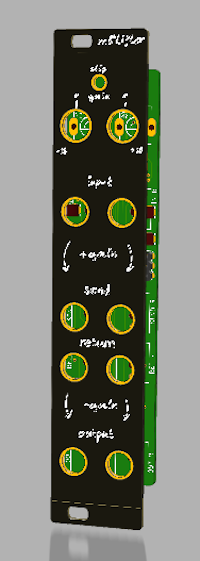

# mb'Lifter 




## What is it

It's a amplifier and attenuator, both coupled and controlled by one knob.

Input -> Amplify -> Attenuate -> Output

or

Input -> Attenuate -> Amplify -> Output.

the middle connection (gained or attenuated signal) can be routed anywhere.

Gain range: -18...+18 dB

It has 2 channels doing this.

Clip indicator - lights up when one of the channels opamps runs into clipping, that is signal level above +-10V peak to peak.

Other features Reverse voltage protection, requires +-12V and needs +-25mA. Width = 5HP = 25mm = almost 1".

### But Why ?

Original idea was to drive an overdrive/distortion unit, so it gains the signal, passes it to the distortion stuff, and then it attenuates to the original levels. In this way the distorted signal does not get louder only distorteder.

### Usecases

* Drive signal into distortion.

### Misuseable as

* InOut - Input an Aux signal (gain Line level to Rack level) AND Output Rack signals with Line level.
* Effect Adapter - Use Guitar effects in your rack - Attenuate to FX(line) level -> FX -> Gain back into Rack Level. Or other way around - use your rack as guitar FX unit.
* Instrument interface - cascade both channels to achive max gain of 36dB, sufficient for Mics and Guitars.
* ...


## Files in repo...

### /pcb

* Lifter01 is the beta version, left here as reference. Had a view minor bugs.
  * Missing feedback caps.
  * 2 wrongly flipped opamp gates.
* Lifter02 - current production version, labeled as "version1.0"
* FrontPCB - as name says.

## License

#### Attribution-NonCommercial-ShareAlike - CC BY-NC-SA 

```
Attribution — You must give appropriate credit, provide a link to the license, and indicate if changes were made. You may do so in any reasonable manner, but not in any way that suggests the licensor endorses you or your use.

NonCommercial — You may not use the material for commercial purposes.

ShareAlike — If you remix, transform, or build upon the material, you must distribute your contributions under the same license as the original.

No additional restrictions — You may not apply legal terms or technological measures that legally restrict others from doing anything the license permits.
```
[All the legal blabla here](https://creativecommons.org/licenses/by-nc-sa/4.0/legalcode)
